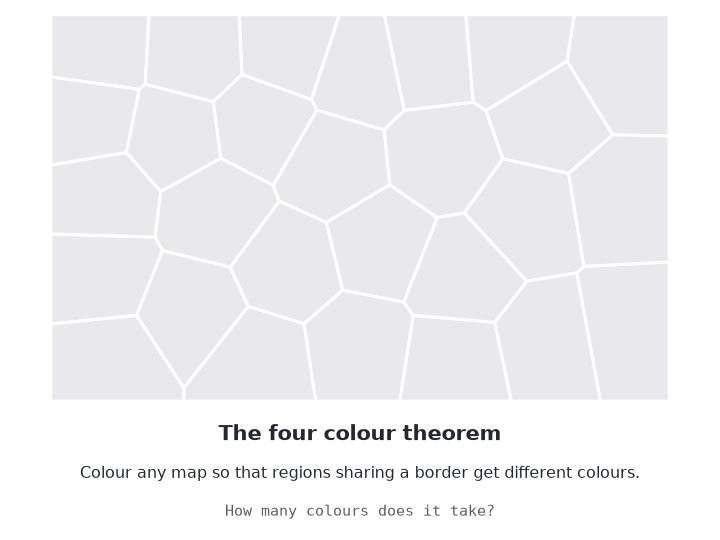

# zig-planar

Planarity testing, embeddings and colourings of planar graphs, in pure Zig
0.17.



- **Planarity test with embedding**: the left-right algorithm in linear time.
  A planar graph comes back with a combinatorial embedding: the neighbours of
  every vertex in cyclic order.
- **Certificates both ways**: an embedding can be checked by tracing its
  faces and computing its genus. A non-planar graph gets a subdivided K5 or
  K3,3, which is checked by a separate routine that runs no planarity test.
- **Colourings**: smallest-last greedy (at most 6 colours on a planar graph),
  a guaranteed 5-colouring by Kempe chains, and a 4-colouring.
- No dependencies and no C. Checked against networkx. MIT licensed.

The 4-colouring is not the near-linear algorithm of Inoue, Kawarabayashi,
Miyashita, Mohar, Thomassen and Thorup (2026). That algorithm depends on a
large set of D-reducible configurations and their reductions. `four` uses
Kempe-chain search instead. Every colouring it returns is proper, but there
is no proven time bound, so it can stop with `error.SearchLimit`.

## Install

```sh
zig fetch --save git+https://github.com/guanchzhou/zig-planar
```

```zig
const planar = b.dependency("zig_planar", .{}).module("planar");
exe.root_module.addImport("planar", planar);
```

## Library

| Module | What it does | Reference |
| --- | --- | --- |
| `graph` | Simple undirected graphs in CSR form, with half-edges and twins | |
| `planarity` | `embed` and `isPlanar`: the left-right planarity test | de Fraysseix and Rosenstiehl 1985; Brandes 2009 |
| `embedding` | Rotation systems: faces, face count and genus | Euler's formula |
| `kuratowski` | `find` a K5 or K3,3 subdivision; `classify` one without a planarity test | Kuratowski 1930 |
| `color` | `greedy`, `five`, `four`, smallest-last order, `isProper` | Matula and Beck 1983; Heawood 1890; Brélaz 1979 |

```zig
const g = try planar.Graph.init(gpa, n, edges);
defer g.deinit(gpa);
if (try planar.planarity.embed(gpa, g)) |e| {
    defer e.deinit(gpa);
    std.debug.assert(try e.genus(gpa) == 0);
    const colors = try planar.color.four(gpa, g, .{});
    defer gpa.free(colors);
}
```

Conventions:

- Self loops and repeated edges are dropped when a graph is built.
- `embed` returns null for a non-planar graph. All three passes of the
  left-right test are iterative, so a path with 200,000 vertices does not
  overflow the stack.
- Faces are traced by following a dart u -> v with the dart from v to the
  neighbour after u in v's rotation. An embedding has genus 0 exactly when
  V - E + F = 2 on every connected component.
- `kuratowski.find` deletes each edge in turn and keeps it deleted while the
  rest stays non-planar. It runs one planarity test per edge, so it takes
  O(m^2) time.
- `five` and `four` return `error.NotPlanar` for a non-planar graph.
- `four` colours in smallest-last order. When all four colours already
  appear around a vertex, it searches up to three Kempe-chain swaps that free
  one. Chains are first tried with a size limit, because a small chain that
  frees a colour works as well as a large one, and two-colour chains in a
  large triangulation can span most of the graph. If a pass gets stuck, it
  tries again with shuffled orders, and finally runs an exact DSATUR search
  with a step limit. `FourOptions.stats` reports which of these succeeded.

[`examples/map.zig`](examples/map.zig) 4-colours the land borders of mainland
South America, where Argentina, Bolivia, Brazil and Paraguay all border each
other, and finds a K3,3 subdivision in the Petersen graph.

## Command line

`zig build` installs `zig-out/bin/zig-planar`. Each command reads one JSON
object on stdin and writes one JSON object on stdout. Edges are `[u, v]`
pairs.

```sh
$ echo '{"n":4,"edges":[[0,1],[0,2],[0,3],[1,2],[1,3],[2,3]]}' | zig-planar planar
{"planar":true,"rotation":[[1,3,2],[0,2,3],[1,0,3],[2,0,1]],"faces":[[0,1,2],[0,3,1],[0,2,3],[1,3,2]]}
$ echo '{"n":6,"edges":[[0,3],[0,4],[0,5],[1,3],[1,4],[1,5],[2,3],[2,4],[2,5]],"certificate":true}' | zig-planar planar
{"planar":false,"kuratowski":{"kind":"K3,3","edges":[[0,3],[0,4],[0,5],[1,3],[1,4],[1,5],[2,3],[2,4],[2,5]]}}
$ echo '{"n":6,"edges":[[0,1],[0,2],[0,3],[0,4],[5,1],[5,2],[5,3],[5,4],[1,2],[2,3],[3,4],[4,1]]}' | zig-planar color
{"colors":[2,0,1,0,1,2],"used":3,"passes":1,"exact_steps":0}
```

`color` takes `"method"`: `"four"` (the default), `"five"` or `"greedy"`.
`zig-planar --help` lists every command. Invalid input exits with 1; an
unknown or missing command exits with 2.

## Performance

Random Delaunay triangulations, ReleaseFast, Apple M5. Times are for the whole
command, including reading and writing JSON.

| Vertices | Edges | networkx 3.7 `check_planarity` | `zig-planar planar` | `zig-planar color` (four) |
| ---: | ---: | ---: | ---: | ---: |
| 100,000 | 299,972 | 5.18 s | 0.37 s | 0.16 s |
| 1,000,000 | 2,999,965 | 62.9 s | 2.32 s | 2.57 s |

Both 4-colourings came from the first Kempe pass, with no exact search.

## Development

```sh
zig build test              # unit, golden, fuzz-corpus, example, and command-line tests
zig build test-cli          # command-line tests only
zig build test --fuzz=10K   # fuzz the invariants (needs .zig-cache/tmp to exist)
zig build docs              # API documentation in zig-out/docs
uv run --with networkx --with scipy --with numpy python test/reference.py   # regenerate test/golden.json
uv run --with numpy --with scipy --with matplotlib python docs/four-colours.py   # regenerate docs/four-colours.gif
```

`test/reference.py` builds 435 graphs: named graphs (K5, K3,3, Petersen,
hypercubes, platonic solids, subdivisions), Delaunay triangulations with
edges removed or added, random graphs and random trees with extra edges. It
records networkx's planarity answer for each, along with three large
triangulations of up to 5,000 vertices. `test/golden.zig` requires:

- the same answer as networkx on every graph;
- for planar graphs, a genus-0 embedding with the right neighbours, and
  proper 6-, 5- and 4-colourings;
- for non-planar graphs with at most 200 edges, a Kuratowski subgraph that
  `classify` accepts.

The fuzz targets check properties on random small graphs:

- every planarity answer comes with a certificate that checks: a genus-0
  embedding or a K5 or K3,3 subdivision;
- planar graphs get proper 5- and 4-colourings;
- smallest-last order is a permutation in which no vertex has more than
  degeneracy later neighbours, and greedy colouring stays within
  degeneracy + 1 colours.

## Credits

- U. Brandes, "The left-right planarity test", manuscript (2009).
- H. de Fraysseix and P. Rosenstiehl, "A characterization of planar graphs
  by Trémaux orders", *Combinatorica* 5(2), 127-135 (1985).
- K. Kuratowski, "Sur le problème des courbes gauches en topologie", *Fund.
  Math.* 15, 271-283 (1930).
- P. J. Heawood, "Map-colour theorem", *Q. J. Pure Appl. Math.* 24, 332-338
  (1890).
- D. W. Matula and L. L. Beck, "Smallest-last ordering and clustering and
  graph coloring algorithms", *J. ACM* 30(3), 417-427 (1983).
- D. Brélaz, "New methods to color the vertices of a graph", *Commun. ACM*
  22(4), 251-256 (1979).
- Y. Inoue, K. Kawarabayashi, A. Miyashita, B. Mohar, C. Thomassen and
  M. Thorup, "The Four Color Theorem with linearly many reducible
  configurations and near-linear time coloring", arXiv:2603.24880 (2026).

## License

MIT. See [LICENSE](LICENSE).
